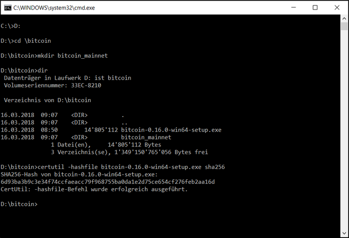
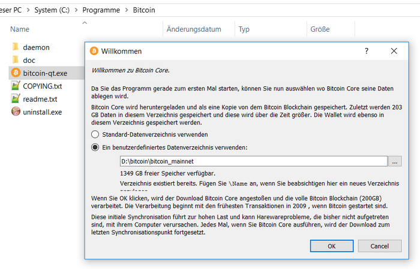

[ [Intro](README.md) ] -- [ **Preparations** ] -- [ [Raspberry Pi](raspibolt_20_pi.md) ] -- [ [Bitcoin](raspibolt_30_bitcoin.md) ] -- [ [Lightning](raspibolt_40_lnd.md) ] -- [ [Mainnet](raspibolt_50_mainnet.md) ] -- [ [Bonus](raspibolt_60_bonus.md) ] -- [ [FAQ](raspibolt_faq.md) ] -- [ [Updates](raspibolt_updates.md) ]

-------
### Un guide pour recycler votre vieux portable en noeud Bitcoin et ⚡Lightning️⚡
--------

# Préparation

## Pré-requis technique

Pour ce guide, j'ai décidé de recycler un de mes anciens ordinateurs portables. 

Votre ordinateur n'a certainement pas les mêmes caractéristiques que le mien, il n'y a donc pas beaucoup de sens à ce que je vous en parle. En revanche, je dois attirer votre attention sur quelques points précis qui vont nous permettre de nous assurer que votre ordinateur sera bien en mesure de faire tourner notre noeud !
* Processeur : si vous souhaitez faire la synchronisation initiale sur la machine-même, veillez à ce que votre machine dispose au minimum d'un quad-core de milieu-haut de gamme pas trop ancien. De mon expérience, un quad-core i7 de 2013 s'en sort à peu près honorablement, mais sur un vieux dual-core de 2009 c'était la catastrophe !
* RAM : De ma propre expérience, je dirai qu'avec 8Go de mémoire vive allouées en quasi-totalité à bitcoin, on ne s'en sort pas trop mal. Si vous avez moins de 4Go, cela risque d'être problématique. 
* Votre disque dur contient-il 500 Go ou davantage ? Si oui, vous pouvez envisager de vous passer d'un disque dur externe. Sinon, je vous conseille fortement d'investir dans un petit HDD de 500 Go minimum. Une alimentation externe est **fortement recommandée** (on parle d'un disque qui va rester sous tension H24, je ne fais pas confiance à l'alimentation fournie par la plupart des ports USB de laptop pour ce type d'utilisation). 
* Une connexion internet. Placez votre noeud dans un endroit où il capte bien le signal wifi de votre box. Si vous pouvez le brancher en filaire, c'est encore mieux. Là encore, voulez-vous synchronisez votre noeud directement sur cette machine ? Si oui, alors il vous faut une connection plutôt bonne car Bitcoin va télécharger plus de 200 Go en quelques heures/jours. Sinon, la consommation de Bitcoin en _run_ est très modeste. 

En fait, vous devez maintenant vous poser la question de la façon dont vous allez effectuer votre synchronisation initiale de la blockchain de Bitcoin, c'est-à-dire le téléchargement et la validation de l'intégralité de l'historique de transactions sur (quasiment) 10 ans !

En effet, c'est cette opération de synchronisation initiale qui peut être douloureuse pour des petites machines. Une fois synchronisé, la quantité d'informations à traiter par le noeud est très raisonnable et à la portée de machines vétustes et/ou modestes. 

Par conséquent, évaluez bien votre ordinateur avec les différents points ci-dessus pour déterminer s'il est raisonnable de lui faire effectuer cette opération. 

Si la réponse est négative, ce n'est pas grave, nous en reparlerons un peu plus bas. 

## Installer Linux

Vous êtes aujourd'hui probablement comme moi il n'y a pas si longtemps que ça : vous utilisez Windows, ou MacOS, vous trouvez que c'est très bien comme ça et vous ne vous êtes jamais posé la question de changer, surtout pas pour ce truc de _geeks_ qu'est Linux. 

Comme pour moi, installer un noeud Bitcoin sur votre vieux portable est donc l'occasion rêvée de vous y mettre !

De toutes façons, vous n'avez pas vraiment le choix :
* Si vous utilisez un ordinateur un peu ancien, Linux est bien plus léger que Windows qui a tendance à faire tourner un peu n'importe quoi en arrière-plan. Installez Linux augmentera significativement les performances que vous pourrez tirer d'un matériel obsolète. 
* Linux est bien supérieur à Windows en termes de sécurité et de stabilité, vous n'aurez pas à vous embêtez avec un antivirus et vous aurez beaucoup moins de plantages.
* Notre objectif est de mettre en place un serveur que vous pourrez interroger y compris quand vous n'êtes pas chez vous. Vous vous imaginez devoir rouvrir l'écran juste pour vérifier que tout va bien avec l'interface graphique ? Je comprends que les lignes de commande vous fassent peur, mais elles ont l'avantage d'être une interface très légère qui vous permettra de contrôler votre noeud à distance, même dans des conditions de connectivité limitées. 

La première étape pour vous sera donc de virer l'installation vétuste de Windows qui se trouve sur votre ancien ordinateur pour mettre un Linux flambant neuf à la place. 

Si vous êtes déjà un utilisateur de Linux, je vous laisse faire une nouvelle installation de votre distro préférée et passer directement à la suite. 

## Download the Bitcoin blockchain
The Bitcoin blockchain records all transactions and basically defines who owns how many bitcoin. This is the most crucial of all information and we should not rely on someone else to provide this data. To set up our Bitcoin Full Node on mainnet, we need to

* download the whole blockchain (~ 200 GB),
* verify every Bitcoin transaction that ever occurred and every block ever mined,
* create an index database for all transactions, so that we can query it later on,
* calculate all bitcoin address balances (called the UTXO set).

:point_right: See [Running a Full Node](https://bitcoin.org/en/full-node) for additional information.

Although we will set up the RaspiBolt for the Bitcoin testnet first, the validation of the Bitcoin mainnet blockchain can take several days. This is the reason why we already start this task now.

### Using a regular computer
You can imagine that the Raspberry Pi is not quite up to this huge task. The download is not the problem, but to initially process the whole blockchain would take weeks or months due to its low computing power and lack of memory. We need to download and verify the blockchain with Bitcoin Core on a regular computer, and then transfer the data to the Pi. This needs to be done only once. After that the Pi can easily keep up with new blocks.

This guide assumes that you will use a  Windows machine for this task, but it works with most operating systems. You need to have about 250 GB free disk space available, internally or on an external hard disk (but not the one reserved for the Pi). As indexing creates heavy read/write traffic, the faster your hard disk the better. An internal drive or an external USB3 hard disk will be significantly faster than one with a USB2 connection.

To copy the blockchain to the Pi later, there are several options:

* **Recommended**: The best configuration is to format the external hard disk of the Pi with the Ext4 file system, which is better suited for our use case. Using SPC, we then copy the blockchain from the Windows computer over the local network.

* **Or**, if you want to use an external hard disk for your Pi that already contains data, eg. because you already downloaded the blockchain, this works as well. You can use the disk as is, but need to skip the formatting part later in this guide.

### Download and verify Bitcoin Core
Download the Bitcoin Core installer from bitcoin.org/download and store it in the directory you want to use to download the blockchain. To check the authenticity of the program, we calculate its checksum and compare it with the checksums provided. 

In Windows, I’ll preface all commands you need to enter with `>` , so with the command `> cd bitcoin` , just enter `cd bitcoin` and hit enter.

Open the Windows command prompt (`Win+R`, enter `cmd`, hit `Enter`), navigate to the bitcoin directory (for me, it's on drive `D:`, check in Windows Explorer) and create the new directory `bitcoin_mainnet`. Then calculate the checksum of the already downloaded program.
```
> G:
> cd \bitcoin
> mkdir bitcoin_mainnet
> dir
> certutil -hashfile bitcoin-0.16.0-win64-setup.exe sha256
6d93ba3b9c3e34f74ccfaeacc79f968755ba0da1e2d75ce654cf276feb2aa16d
```


Compare this value with the [release signatures](https://bitcoin.org/bin/bitcoin-core-0.16.0/SHA256SUMS.asc). For the Windows v0.16.0 binaries, its
```
32 bit:  7558249b04527d7d0bf2663f9cfe76d6c5f83ae90e513241f94fda6151396a29
64 bit:  6d93ba3b9c3e34f74ccfaeacc79f968755ba0da1e2d75ce654cf276feb2aa16d
```
Usually, you would also need to check the signature of this file, but it's a pain on Windows, so we will do it on the Pi later on.

### Installing Bitcoin Core
Execute the Bitcoin Core installation file (you might need to right-click and choose "Run as administrator") and install it using the default settings. Start the program `bitcoin-qt.exe` in the directory "C:\Program Files\Bitcoin". Choose your new “bitcoin_mainnet” folder as the custom data directory.



Bitcoin Core opens and starts immediately syncing the blockchain. Unfortunately, we need to set one additional setting in the “bitcoin.conf” file, otherwise the whole blockchain will be useless. Using the menu, open `Settings` / `Options` and click the button `Open Configuration File`. Enter the following line:
```
txindex=1
```
If your computer has a lot of memory, you can increase the database in-memory cache by adding the following line (with megabytes of memory to use, adjusted to your computer) as well:
```
dbcache=6000
```
Save and close the text file, quit Bitcoin Core using `File` / `Exit` and restart the program. The program will start syncing again. 

Let the blockchain sync for now, we can already start working on the Pi.

---
Next: [Raspberry Pi >>](raspibolt_20_pi.md)
