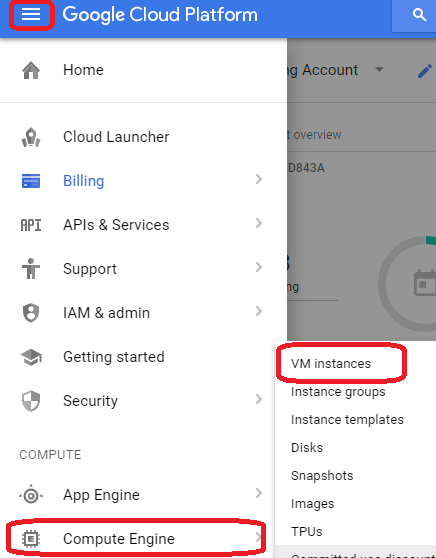

$ wget https://github.com/lightningnetwork/lnd/releases/download/v0.4.1-beta/lnd-linux-amd64-v0.4.1-beta.tar.gz

$ tar -xvzf lnd-linux-amd64-v0.4.1-beta.tar.gz

$ mkdir .lnd
$ mv tls.cert .lnd
$ mv readonly.macaroon .lnd

# Introduction

This guide explains how to automatically unlock the RaspiBolt LND wallet using a computer at a different location. The objective is to have a 'Lights Off' RaspiBolt that recovers automatically all the way to an unlocked wallet in the event that it is rebooted and unattended - e.g. a power failure.

If the wallet remains unlocked, the lnd server is effectively offline and can not participate in the Lightning Network.

This guide uses a free virtual machine on [Google Cloud Platform](https://cloud.google.com/), but any 24/7 linux server to which you have access should work. It could be another Raspberry Pi at a different location.

# Security

To unlock a wallet, the password must be entered. If that password is stored on the RaspiBolt, the wallet funds are vulnerable to anyone with physical access to the RaspiBolt. This guide uses a remote computer to store the Password, but limits the functionality that the remote computer can perform; specifically it can not spend any wallet funds.

|After RaspiBolt reboot| Hacker Can|Hacker Can Not|
|------|---|-------|
|RaspiBolt Physical Access||See Wallet Password, Open Wallet, Spend BTC |
|Remote Computer Login|See Wallet Password, Open Wallet|Spend BTC|

# Preparation

* You will need a (free) [Google](https://google.com) account.
* Your RaspiBolt must be behind a firewall with either:

** A static public IP, or
**  A public [Fully Qualified Domain Name](https://en.wikipedia.org/wiki/Fully_qualified_domain_name). This can be provided using a [Dynamic DNS Service](https://en.wikipedia.org/wiki/Dynamic_DNS).

# Procedure

## Create Free Google Clould Platform (GCP) Virtual Machine (VM) instance

* Visit [GCP](https://cloud.google.com/free/). 

Click *Try It Free* 
Setup Billing as needed. You get US$300 free usage.

* Create your VM

Click the Hamburger menu icon > Compute Engine > VM Instances
Click *Create Instance*
Select Machine Type = *Micro*
Select Boot Disk = *Debian GNU/Linux*
Click *Create*

Note the External IP of your new VM

|VM External IP|__________________________________|
|--------------|---------------------|

Select Connect > *Open in browser window*

Add image 02.png

## Create new Certificate/Key file pair

## Update lnd to use new Certificate/Key files

## Setup the VM

