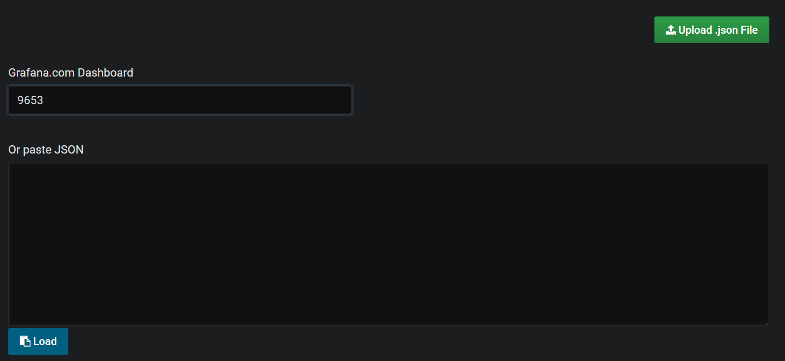
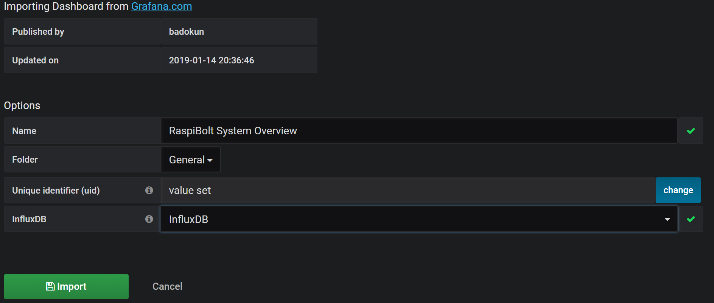
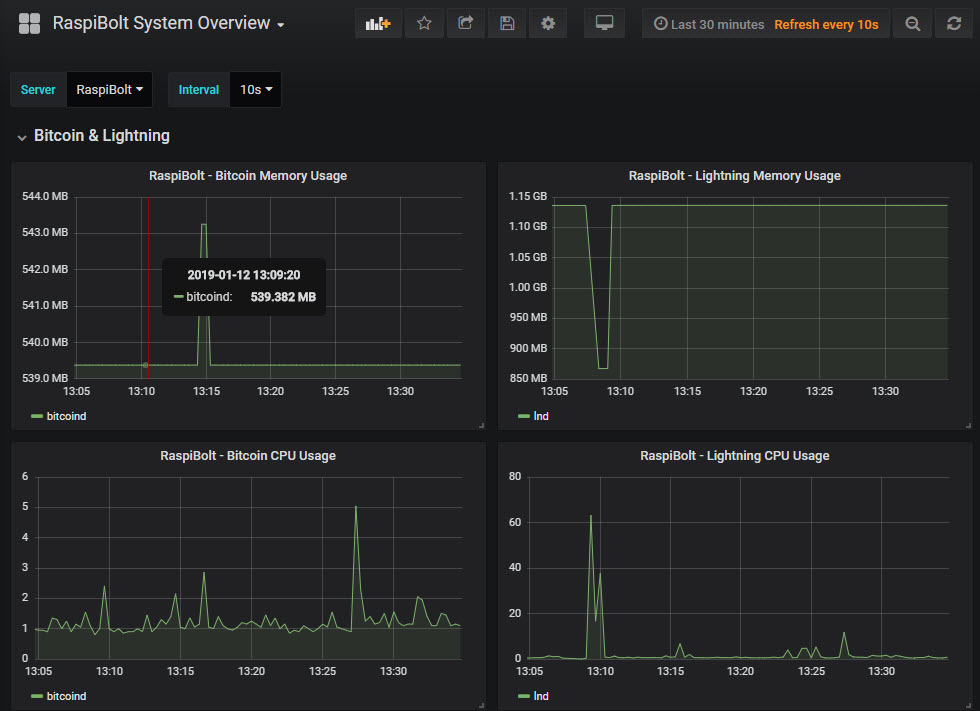

[ [Intro](README.md) ] -- [ [Preparations](raspibolt_10_preparations.md) ] -- [ [Raspberry Pi](raspibolt_20_pi.md) ] -- [ [Bitcoin](raspibolt_30_bitcoin.md) ] -- [ [Lightning](raspibolt_40_lnd.md) ] -- [ [Mainnet](raspibolt_50_mainnet.md) ] -- [ [**Bonus**](raspibolt_60_bonus.md) ] -- [ [Troubleshooting](raspibolt_70_troubleshooting.md) ]

------

### Beginner’s Guide to ️⚡Lightning️⚡ on a Raspberry Pi

------

## Bonus guide: Performance Monitoring
*Difficulty: intermediate*

> Please note: this guide has not been updated to LND 0.5 yet and might not work as intended.

It's useful to have insights into the performance of your
bitcoin and lightning node.

Observing anomolies and doing performance tuning is greatly
improved when you know what is running.

As an added bonus feature you can now have high level 
blockchain analysis and metrics. How big is the mempool,
how many open channels does your lightning node have, etc.

### Overview

There are a few required pieces to get this working
- Docker
- InfluxDB
- Telegraf
- Grafana
- dotNet Influx Metrics Publisher

### Reference:
Thanks to Pete Shima's [medium post](https://medium.com/@petey5000/monitoring-your-home-network-with-influxdb-on-raspberry-pi-with-docker-78a23559ffea) that helped greatly in setting this up.

# [Docker](https://www.docker.com)

Install docker by running the following commands
```
$ cd download/
$ curl -fsSL get.docker.com -o get-docker.sh
$ sudo sh get-docker.sh
```

Confirm that it's working
```
$ sudo docker --version
Docker version 18.09.0, build 4d60db4
```

If you're willing to take the security risk as [outlined here](https://docs.docker.com/engine/security/security/#docker-daemon-attack-surface) you can execute `docker` commands without the `sudo` prefix

```
$ sudo usermod -aG docker $USER
```

Logout and connect again for the changes to take effect, and test with the command below
```
$ docker run hello-world
```

# [InfluxDB](https://www.influxdata.com/)

Running InfluxDB with auto-restart in the event of a system restart
```
$ sudo docker run -d --name=influxdb --net=host --restart always --volume=/var/influxdb:/data hypriot/rpi-influxdb 
```

# [Telegraf](https://docs.influxdata.com/telegraf)

```
$ wget https://dl.influxdata.com/telegraf/releases/telegraf_1.7.0-1_armhf.deb
$ sudo dpkg -i telegraf_1.7.0-1_armhf.deb
$ rm telegraf_1.7.0-1_armhf.deb
$ sudo systemctl status telegraf
```

This would have installed Telegraf as a service, so let's confirm this:
```
$ sudo systemctl status telegraf
```

Enter `Ctrl-C` or `q` to exit after entering the status command above

We need to update the `telegraf.conf` so it publishes the data we'll be using later in our Grafana dashboard

```
cd /etc/telegraf/
sudo cp telegraf.conf telegraf.conf.bak
sudo rm telegraf.conf
sudo wget https://raw.githubusercontent.com/badokun/guides/master/raspibolt/resources/telegraf.conf
sudo systemctl restart telegraf
```


# [Grafana](https://grafana.com/)

```
[ A ] Grafana Admin password
```

Create persistent storage for Grafana so when it's upgraded in future you won't lose all your configuration
```
sudo docker volume create grafana-storage
```

Run the Grafana's docker image, replacing the `admin` password setting `PASSWORD_[A]` with your password. This will be used when logging into Grafana's UI

```
 sudo docker run \
    -d \
    -e "GF_SECURITY_ADMIN_PASSWORD=PASSWORD_[A]" \
    --name grafana-master \
    -v grafana-storage:/var/lib/grafana \
    --restart always \
    --net=host \
    grafana/grafana:master
```

Confirm Grafana is running by running 
```
sudo docker ps
```

You should see something like this:
```
CONTAINER ID        IMAGE                    COMMAND                  CREATED              STATUS              PORTS               NAMES
3194df6aff01        grafana/grafana:master   "/run.sh"                About a minute ago   Up About a minute                       grafana-master
b9f31d893601        hypriot/rpi-influxdb     "/usr/bin/entry.sh /…"   38 hours ago         Up 2 hours                              influxdb

```

At this point we can start to setup a Grafana's Dashboard.

Go to `http://192.168.1.40:3000` replacing the IP address with your RaspiBolt's.

After logging  into the Grafana website with `admin` and `PASSWORD_[A]` you should see this


## Add a data source

Click on Add data source, then InfluxDB


## Add a Dashboard

### Locate the shortcut to the left of the page and click on Manage


###  We will be importing an existing Dashboard

> The import process will be improved once the latest release of the Grafana docker container is used. 
In order to get the official Grafana version (which supports Rasberry Pi) we had to use a pre-released one.


###   Copy the contents of RaspiBolt's [Grafana Dashboard Json](https://raw.githubusercontent.com/badokun/guides/master/raspibolt/resources/grafana-dashboard.json) into the JSON input field. 

> In a future update we'll be referencing a Grafana dashboard id instead




### You may leave the properties unmodified and click on Import



### You should see the dashboard in all its glory




# Future enhancements

* Support for Bitcoin and Lightning metrics, e.g. mempool size, number of open channels, etc

------

<< Back: [Bonus guides](raspibolt_60_bonus.md) 
