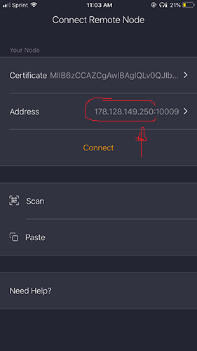

[ [Intro](README.md) ] -- [ [Preparations](raspibolt_10_preparations.md) ] -- [ [Raspberry Pi](raspibolt_20_pi.md) ] -- [ [Bitcoin](raspibolt_30_bitcoin.md) ] -- [ [Lightning](raspibolt_40_lnd.md) ] -- [ [Mainnet](raspibolt_50_mainnet.md) ] -- [ [**Bonus**](raspibolt_60_bonus.md) ] -- [ [Troubleshooting](raspibolt_70_troubleshooting.md) ]

------

### Beginner’s Guide to ️⚡Lightning️⚡ on a Raspberry Pi

------

## Bonus guide: Zap IOS Lightning Wallet
*Difficulty: medium*

This guide describes how to use Zap IOS from within your own network, the same that also connects your RaspiBolt.


Zap is a free Lightning Network wallet focused on good user experience and ease of use. It is in alpha testing, so **use it at your own risk**. Ycan find more details in the [Zap iOS GitHub repository](https://github.com/LN-Zap/zap-iOS). If you find bugs, you can contribute to this project by [reporting issues](https://github.com/LN-Zap/zap-iOS/issues).  

### Preparation on the RaspiBolt

#### Prepare LND Node for gRPC access"  
First we make sure that LND is listening for connections from other computers on the gRPC interface.

* Login as user "admin" 

* Allow connections to the RaspiBolt from your own network. Check how the ip address of your Pi is starting with, eg. 192.168.0 or 192.168.1 , and use the address accordingly. Ending with .0/24 will allow all IP addresses from that network.  

  Add the following lines to the section `[Application Options]`:  
  `$ sudo nano /home/bitcoin/.lnd/lnd.conf` 
  ```
  tlsextraip=192.168.0.0/24
  rpclisten=0.0.0.0:10009
  ```
   
* Delete tls.cert (restarting LND will recreate it):  
  `$ sudo rm /home/bitcoin/.lnd/tls.*`

* Restart LND :  
  `$ sudo systemctl restart lnd`  
  
* Copy the new tls.cert to user "admin", as it is needed for lncli:  
  `$ sudo cp /home/bitcoin/.lnd/tls.cert /home/admin/.lnd`

* Unlock wallet  
  `$ lncli unlock` 

* Allow the ufw firewall to listen on 10009 from the LAN:  
  `$ sudo ufw allow from 192.168.0.0/24 to any port 10009 comment 'allow LND grpc from local LAN'`

* restart and check the firewall:  
  `$ sudo ufw enable`  
  `$ sudo ufw status`  

#### Install LND Connect
The nifty helper tool LND Connect helps to pair the RaspiBolt with the iPhone, encoding connection and authorization information either into a QR code or a connection string.

* As user "admin", download, extract and install the current release from the [release page](https://github.com/LN-Zap/lndconnect/releases). 
  ```
  $ cd /tmp
  $ wget https://github.com/LN-Zap/lndconnect/releases/download/v0.1.0/lndconnect-linux-armv7-v0.1.0.tar.gz
  $ sudo tar -xvf lndconnect-linux-armv7-v0.1.0.tar.gz --strip=1 -C /usr/local/bin
  ```
* Display the help page to make sure it works.  
  ```
  $ lndconnect -h
  ```
  
### Generate QR code and read from Zap iphone app

* Now simply run lndconnect to generate the QRCode we’ll scan from our iPhone
  ```
  $ lndconnect --lnddir=/home/admin/.lnd
  ```
  This will generate a QRCode.  
  Depending on your screen size use cmd + and cmd - to adjust the size of the QRCode  
  If you can't resize or have visualization problem you can add -j to display url instead of a QRCode  
  See https://github.com/LN-Zap/lndconnect for more details.  

* Open ZAP APP from your phone  

* Scan the QR code and check/modify the IP address you want to use to connect. (example 192.168.x.x)  

<p align='center'>  </p>

* A successful connection will take you into the Zap iOS application:

<p align='center'>  </p>


⚠️
REMEMBER: If you change lnd.conf you need to recreate tls.cert and also to re-create and re-scan qr from zap app.  
         In that case remeber also to copy the new TLS cert and admin macaroon files to the admin user.  
         If you log out from the session you need to setup go environment variables again to execute lndconnect or it will give you  
         `> -bash: lndconnect: command not found`.   

👉 It is perfectly possible to use Zap on-the-go (from internet) and connect to your node at home, but this involves creating new TLS certificates and reduce security. You need to set tlsextraip=<YOUR_PUBLIC_IP> and allow the ufw firewall to listen on 10009 from evrywhere.
