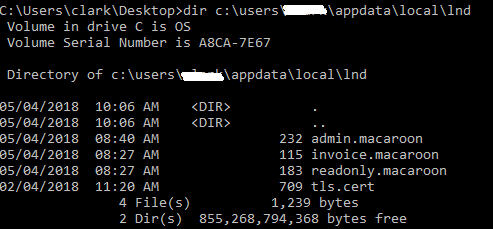

## Bonus guide: Use `lncli` on a different computer

*Difficulty: easy*

It is possible to run *lnd* on the RaspiBolt, and *lncli* on a different computer. The instructions below explain how to install *lncli* on a Windows PC and communicate with the RaspiBolt. Instructions for different computer systems (MAC, Linux, ...) will be very similar.

In these instructions, it is assumed the lncli computer is on the same LAN as the RaspiBolt. It is possible for the lncli computer to be outside the local LAN but that introduces additional security risks and will not be included in this guide.

## RaspiBolt

- Login as admin

- Allow port 10009 in the firewall

```
admin ~  ฿  sudo su
root@RaspiBolt:/home/admin#  ufw allow from 192.168.0.0/24 to any port  10009 comment 'allow lnd rpc from Local LAN'
root@RaspiBolt:/home/admin#  ufw status
root@RaspiBolt:/home/admin#  exit
```
- Add one new line in the [Application Options] section of lnd.conf to allow rpc from more than just the default localhost  
  `admin ~  ฿  sudo nano /home/bitcoin/.lnd/lnd.conf`

```
[Application Options]
rpclisten=0.0.0.0:10009
```

- Temporarily allow admin.macaroon to be copied  
  `admin ~  ฿ sudo chmod 777 /home/bitcoin/.lnd/admin.macaroon`

## Windows PC

- Use your browser to visit https://github.com/lightningnetwork/lnd/releases

- Download the file for your OS. For Windows10 it will generally be lnd-windows-amd64-vx.x.x.zip

- Open the compressed file and extract the lncli application (e.g. lncli.exe) to your desktop.
   

- Open a CMD window  
  `Press Win+R, enter cmd, then press Enter` 


- Change to the directory where you saved lncli.exe, and view the help information

```
> cd %USERPROFILE%\desktop
> lncli
...
GLOBAL OPTIONS:
   --rpcserver value        host:port of ln daemon (default: "localhost:10009")
   --lnddir value           path to lnd's base directory (default: "C:\\Users\\xxxx\\AppData\\Local\\Lnd")
   --tlscertpath value      path to TLS certificate (default: "C:\\Users\\xxxx\\AppData\\Local\\Lnd\\tls.cert")
   --no-macaroons           disable macaroon authentication
   --macaroonpath value     path to macaroon file (default: "C:\\Users\\xxx\\AppData\\Local\\Lnd\\admin.macaroon")
   --macaroontimeout value  anti-replay macaroon validity time in seconds (default: 60)
   --macaroonip value       if set, lock macaroon to specific IP address
   --help, -h               show help
   --version, -v            print the version
```
- Take note of the default (base) directory

- Make the necessary default directory  
  `> mkdir %LOCALAPPDATA%\Lnd`
* Follow the instructions in  [ [Mainnet](raspibolt_50_mainnet.md) ]  to use WinSCP to copy the files shown
  * Local:  `\Users\xxxx\AppData\Local\Lnd`
  * Remote: `/home/bitcoin/.lnd/`
  * Files: `See below`

  


 - Back on the RaspiBolt: Reset admin.macaroon permissions  
   `admin ~  ฿ sudo chmod 600 /home/bitcoin/.lnd/admin.macaroon`


- Run lncli on the PC
```
> cd %USERPROFILE%\desktop
> lncli  --rpcserver ip.of.your.raspibolt:10009  getinfo
```

## A word on Permisson Files (Macaroons)

By default, *lncli* will load *admin.macaroon* and hence have full privileges. To limit what the lncli computer can do you can delete unneeded macaroon files and start *lncli* specifying the approprate macaroon.

Example

```
>lncli  --macaroonpath %LOCALAPPDATA%\Lnd\readonly.macaroon --rpcserver ip.of.your.raspibolt:10009  addinvoice --amt=100
[lncli] rpc error: code = Unknown desc = permission denied
```

The table below shows which commands are permitted by each macaroon

* ? = Not checked
* n = Not Checked, presumed No
* No  = No (checked, v0.4.1)
* Yes = Yes (checked, v0.4.1)


|Command|admin|readonly|invoice|
|-------| :---: |:---: | :---: |
|create|Yes|n|No|
|unlock|Yes|Yes|Yes|
|newaddress|Yes|No|Yes|
|sendmany|Yes|n|n|
|sendcoins|Yes|n|n|
|connect|Yes|n|No|
|disconnect|Yes|n|No|
|openchannel|Yes|n|No|
|closechannel|Yes|n|No|
|closeallchannels|Yes|n|No|
|listpeers|Yes|Yes|No|
|walletbalance|Yes|Yes|No|
|channelbalance|Yes|Yes|No|
|getinfo|Yes|Yes|No|
|pendingchannels|Yes|Yes|No|
|sendpayment|Yes|n|No|
|payinvoice|Yes|n|No|
|addinvoice|Yes|No|Yes|
|lookupinvoice|Yes|Yes|Yes|
|listinvoices|Yes|Yes|Yes|
|listchannels|Yes|Yes|No|
|listpayments|Yes|Yes|No|
|describegraph|Yes|Yes|No|
|getchaninfo|Yes|Yes|No|
|getnodeinfo|Yes|Yes|No|
|queryroutes|Yes|Yes|No|
|getnetworkinfo|Yes|Yes|No|
|debuglevel|Yes|No|No|
|decodepayreq|Yes|Yes|No|
|listchaintxns|Yes|Yes|No|
|stop|Yes|No|No|
|signmessage|Yes|n|n|
|verifymessage|Yes|?|n|
|feereport|Yes|Yes|No|
|updatechanpolicy|Yes|No|No|
|fwdinghistory|Yes|Yes|No|

*Guide by robclark56, thanks!*

------

<< Back: [Bonus guides](raspibolt_60_bonus.md) 